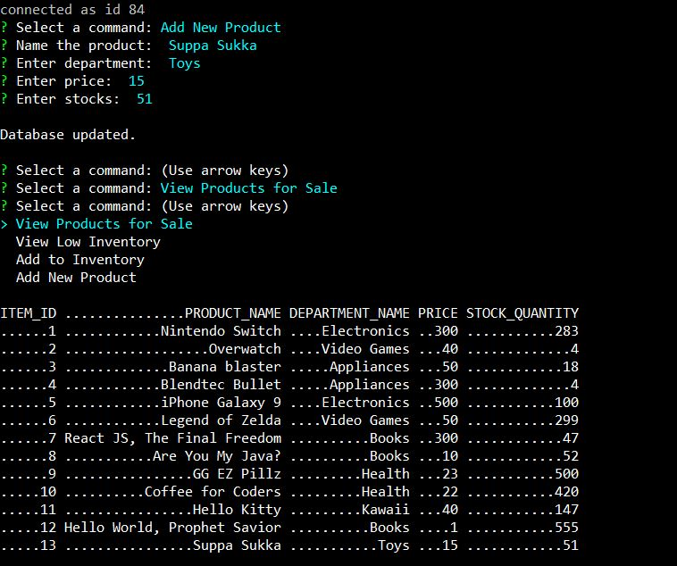

# Bamazon

## Overview
Bamazon is a Amazon-like storefront using MySQL. The app takes orders from users and deplete stock from the store's inventory, track products saves across the store's departments, and provide a summary of department's sales record.

#### Built with
  - Node.js
  - mySQL
- - -

### `node bamazonCustomer.js`
1. Display sales inventory

2. User can purchase the product by selecting itemID and enter the quantity user want to buy and updates sales inventory and asks for another transaction.

3. If user place an order where the ran out of stocks, it will log 'Insufficiant quantity' and asks for another transaction.

- - -

### `node bamazonManager.js`
- List a set of menu options:

  

  * View Products for Sale: List available items

  

  * View Low Inventory: Display items with stock count lower than 50

  

  * Add to Inventory: Stock more of any item in the store

  

  * Add New Product: Adds a new product to the store

  

- - -

### `node bamazonSupervisor.js`
- List of set menu options:

    

  * View Product Sales: Display the supervisor view where views departmentID, department_name, over_head_costs, total_sales, and total_profit.
  note: 'total_profit' is the difference of 'over_head_costs' and 'total_sales and is not stored in database. See Example below.

    

  * Create New Department: Adds a new item category.

    

- Example:

  * 'Suppa Sukka' item is purchased with quantity of 5. Total cost $75 which profits to the store from `bamazonCustomer.js`.

  

  * The profit value is added into the supervisor table from `bamazonSupervisor.js` from -250 to -175.

  
